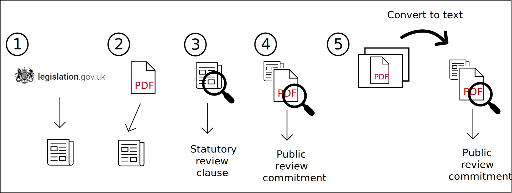

## How the tool works

A complete run of the Better Regulations Tool involves a number of different steps.



<div>

1.  Legislation URL Scrape

    > The tool searches legislation.gov.uk using a specific search term and date range - then scrapes URl links for all the pieces of legislation that match the search

2.  More Resources Scrape

    > For each piece of legislation found in step 1, the tool scrapes links to all the PDFs on 'More Resources ' tab on legislation.gov.uk. This will include Impact Assessments (IAs) and Post-Implementation Reviews.

3.  Extract Statutory Review Clause from Text

    > For each piece of legislation collected in step 1 and 2, the tool will search the main body of the text for review clauses and extract them.

4.  Extract Public Review Clause from IA

    > For each piece of legislation collected in step 1 and 2, if that legislation has any associated IAs (and those IAs are not scans or photocopies) - the tool will extract any public review clauses from the IA

5.  Processed scanned PDFs

    > Convert any IA PDFs that are images (ie scanned/photocopied) into text and repeat step 4

The output is then saved to excel.

</div>
<br>
<br>

## Changing the parameters

Settings for the better regulations tool are held in configuration files. By default, settings are read from `example_config.yml` in the `inputs/configs` folder.

The search of legislation.gov.uk for review clauses can be customized by changing the configuration file, or creating a new one.

To change which configuration file the tool is reading from, edit the `config path` in `main.py`

```         
config_path = base_dir / "inputs/configs/example_config.yml"
```

The following section will explain the configuration file settings.
<br>
<br>

### Run name and toggles

#### Run Name

`run_name` refers the name of each "run" of the code.

The `run_name` determines where files and logs are saved, so if you change parameters and re-run the tool you will overwrite the output previous run. We recommend changing the run name whenever you make any big parameter changes.

#### Toggles

Toggles switch on/off particular parts of the pipeline by setting the value to True or False. This means that users can tweak the review clause extraction settings for steps 3 and 4, without having to rerun the scraping in steps 1 and 2 (which can be time consuming).

| `scrape_links`: (step1) if True, scrape for legislations that match the search<br>
| `scrape_more_resources`: (step 2) if True, scrape for associated PDFs for each legislation scraped from step 1<br>
| `extract_review_clauses`: (step 3 and 4) if True, extract review clauses from legislation text and any Impact Assessments <br>
| `convert_scanned_pdfs`: (step 5) if True, convert any scanned Impact Assessments to text and extract review clauses<br>

<br>
<br>

### Scraping settings

The `scraping` section of the config covers settings that define the initial search of legislations.gov.uk

| `start_year`: The earliest year to conduct search from<br>
| `end_year`: The latest year to conduct search up until<br>
| `search_term`: The term to search for within legislation. This is usually a term that is specific to a Departments legislation.<br>

For example running the tool with the `scraping` section of the config that looks like this:

```         
scraping
    start_year: 2005
    end_year: 2010
    search_term: "Signed by authority of the Secretary of State for Health"
```

Will search legislation.gov.uk for legislations enacted between 2005 and 2010, that contain the term "Signed by authority of the Secretary of State for Health" - and scrape links to all pieces of legislation covered by this search - [for example](https://www.legislation.gov.uk/all/2005-2010?text=Signed%20by%20authority%20of%20the%20Secretary%20of%20State%20for%20Health)
<br>
<br>

### Text review clause extraction settings.

This section covers settings that influence the extraction of statutory review clauses from the main text of the legislation

| `search_terms`: A list of terms that match review clauses to search for within the legislation.<br>

| `n_sentences`: The length of the section to extract

The tool will find all occurrences of the `search_terms` in the text, and extract all non overlapping matches. `search_terms` should therefore be sections of sentences that are unique to review clauses. This part of the tool searches for an exact match, so its is important any `search_terms` are added in exactly the same format as they are found in the legislation text.

For example running the tool with a `text_review_clause_extraction` section of the config that looks like this:

```         
text_review_clause_extraction

    search_terms: [
        "review of the regulatory provision",
        "Review Regulation",
        "The Secretary of State must from time to time"]
    n_sentences: 4
```

Will extract every non-overlapping section of 4 sentences in the legislations main text, that contain any of the three search terms.
<br>
<br>

### Impact Assessment review clause extraction settings.

Extracting review clauses from the Impact Assessment (IA) PDFs is a little more complex that from the main text of the legislation.

The tool will first try to find the section of the IA that contains a review clause - and will then extract information from that section.

The tool will try to find a review clause section in the following manner.

1.  First, the tool will try to find an exact match in the IA for any of the `match_sentences` supplied (this works similar to searching the main body of the text)

2.  If no exact match is found - the tool will try to find the most "similar" section of the PDF to a generic review query.

3.  If it can't find a similar section - the tool will conclude there is no mention of review in the IA pdf

Impact Assessment review clause extraction settings have two sections.

***

#### Query settings

These concern how the tool is querying the Impact Assessment to extract information.

| `match_sentences`: A list of terms that match IA review sections to search for within the IA pdf

This parameter works like `search_terms` did for searching the main legislation text.

Impact Assessment formats have changed over the years. The default `match_sentences` provided match with the review section of three commonly occurring IA formats.

If you find you are commonly encountering a IA review section that is not one of the three provided, you can add a distinctive sentence from that section to `match_sentences` in order to pick up those IA review clauses more accurately.

**Some of the query settings need to be stable for the tool to work** - These settings are highlighted below and we recommend leaving these as their default value.

`n_sentences`: The length of the section to select when extracting review details. **We recommend leaving as default**<br> `clause_query`: Used by the tool to extract review information **We recommend leaving as default**<br> `date_query`: Used by the tool to extract review information **We recommend leaving as default**<br> `similarity_threshold`: How "similar" a non-exact matching section must be to be considered a review clause section. **We recommend leaving as default**<br>

For example - a config.yml file with an `IA_review_clause_extraction` section that looks like this:

```         
query_settings:
    match_sentences: [
        'When will the policy be reviewed to establish its Impact and the extent to which the policy objectives have been achieved',
        'When will the policy be reviewed to establish the actual costs and benefits and the achievement of the desired effects',
        "Will the policy be reviewed"]
```

Will try to find a section of the Impact Assessment that exactly matches one of the three `match_sentences`, before trying to find the most "similar" sections. If it finds a section that looks like a review clause - it will extract information.

***
#### Model settings

These refer to the names of the models the tool uses to extract information and perform similarity search. We recommend these be left as default.


<br>
<br>

## Running the code

After customizing settings the `example_config.yml` file and activating the `better-regulations-tool-env` conda environment the tool can be run from `main.py` in the root directory with the command:

```         
python main.py
```
All outputs from code will be saved in a folder named after the `run_name` parameter, lcoated within in outputs folder.

<br>

### Logs and configs

Whilst the code is running information such as the number of files being processed, or if any errors have been encountered are displayed in the log.

The log will be displayed in the terminal, but also saved in the "outputs/{RUN_NAME}" folder in a file called `run.log`.

Each time an run of the tool completes, the config used for that run will be timestamped and saved in the "outputs/{RUN_NAME}" folder.

<br>
<br>

## Interpreting the output

After the tool has finished extracting review clauses, it will save the results to an excel file at "outputs/{RUN_NAME}/final_output.xlsx".

The meaning of each column in the final_output.xlsx file is explained below

<br>

### Descriptive columns

These columns provide information about the piece of legislation being evaluated

| Title: title of the legislation<br>

| Link: link to the legislation on legislation.gov.uk<br>

<br>

### Review clause columns

These columns contain information on statutory/public review clause information extracted from the legislation main text and Impact Assessments

| Text Review Clause: Sections of the legislation text that matched review clause wording

| IA Review Clause: Wording of public review commitment in Impact Assessment<br>

| IA Review Date: Date of public review commitment in Impact Assessment<br>

Sometimes legislation will have multiple Impact Assessments. In these cases, review clause/date information will be stored in the same cell in the following format \[(date1, source1), (date2, source2)\]

<br>

### Diagnostic columns

These columns provide information on how information was extracted from Impact Assessments

| Scanned PDF: If True, Impact Assessments for this piece of legislation were scanned/photocopied<br>

| Match: Either a) the matching review section sentence found in this legislations Impact Assessment or b) "similarity search" if no match could be found

To Note:

-   Converting a scanned or photocopied PDF into text can introduce errors. We recommend that extra care is taken to verify review clause information extracted from scanned Impact Assessments

-   Extracting review information via "Similarity search" is less reliable than when an exact match is made. We recommend that extra care is taken to verify review clause information extracted via "similarity search"


### Link Columns

These columns provide hyperlinks to each of the PDFs found on "More Resources Page" for each piece of legislation.
The link column are split into three categories:

| IAs_x: Contain links to Impact Assessments<br>

| PIRs_x:  Contain links to Post Implementation Reivew<br>

| Other_Resources_x: Contain links to PDFs that are neither an Impact Assessment nor a Post Implementation Reivew<br>

The number of link columns in the output excel file is dependent on the maximum number of resources of that category held by a single piece of legislation.
For example, if the the maximun number of IAs for a single piece of legislation is 4, then there will be 4 IA link columns [IA_1, IA_2, IA_3, IA_4].
For each row, "IA_1" will hold the link to the first IA pdf for that piece of legislation, IA_2" will hold the link to the second IA pdf for that legislation (if it has one), and so on. 
